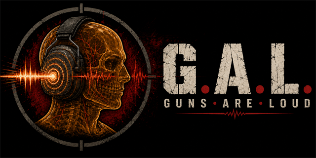

# Guns Are Loud (G.A.L.) – realistic gunshot sound, hearing loss and tinnitus for SPT

**Guns Are Loud** is a client audio mod for **SPT (Single Player Tarkov)**, the offline Escape From Tarkov project. It makes your own gunfire sound heavy and physical, gives every cartridge its own weight, and makes firing a rifle indoors hurt your hearing. Temporary hearing loss and tinnitus build up with sustained fire. Grenade blasts can leave you half deaf for minutes. Active headsets such as the Peltor ComTac, Sordin Supreme and Walker's Razor are modelled from published attenuation data, not a single volume slider.

It is not a sound pack. EFT's original weapon recordings stay in place. The mod adds a pitched-down copy of the same recording for low-end punch, reshapes the room response, and models what that noise does to your ears and to your headset.

## Features

- **Heavier first-person gunshots.** An octave-down copy of the game's own recording adds low end and impact to every shot, including every round of automatic fire, and follows the rate the weapon actually fires at.
- **Caliber differences you can hear.** Pistol rounds, intermediate rifle cartridges such as 5.45×39, full-power rounds such as 7.62×54R, shotgun shells and heavy 12.7 mm rounds sit at different weights. Suppressors take most of the added impact away.
- **Indoor gunfire.** Shots inside buildings get stronger room reflections and a bigger hearing dose.
- **Hearing loss and tinnitus.** Muffling and ear ringing accumulate with fire and recover slowly after long bursts. The exposed ear takes more damage on a rifle, and switching shoulders mirrors it. Each effect has its own switch, intensity and duration.
- **Grenade concussion.** Nearby explosions cause strong, long hearing loss and ringing that depend on distance, indoor or outdoor position, walls between you and the blast, and your headset.
- **Realistic active headsets.** Passive ear-cup isolation per frequency plus an electronic hear-through path that clamps on loud events and recovers in quiet. Profiles are built from a reference of 29 headset items across 15 real models, including items added by WTT-ContentBackport and Epic's All In One. Headset inspection shows low, mid and high attenuation.
- **Gunshot contrast.** Ambience, footsteps and speech are lowered by a set amount so gunfire stands out. Music, UI and voice chat are untouched.
- **No crackle on the loudest shots.** An output safety limiter rounds off peaks in the last half decibel instead of clipping.
- **Built for long raids.** The mod keeps its processing off sounds that are not your own shots, and sustained automatic fire late in a long raid no longer turns into stutter.

## What it does not change

Ballistics, recoil, damage, health, AI hearing, remote players' gunshot sources and EFT's sound files are untouched. Headset characteristics live in the client, so no server-side item changes are needed. Unknown headsets and unavailable audio routes fall back to vanilla processing.

Levels are relative digital values, not calibrated sound pressure. Do not use this mod to judge real hearing protection or real exposure to gunfire.

## Compatibility

Version 1.0.3.

- SPT 4.1.5 on Windows x64, verified Unity 2022.3.43f1 player build.
- BepInEx 5, included with SPT. No Unity Editor, compilation, installer or game-file patch.
- The preloader checks exact UnityPlayer and DSP hashes. Other player builds are not automatically supported.

## Installation

Close the game and extract the archive into the SPT installation root. Merge the BepInEx folders; do not replace the whole BepInEx directory.

Included components:

- `BepInEx/plugins/GunsAreLoud/GunsAreLoud.Client.dll` (client and embedded mixer).
- `BepInEx/patchers/GunsAreLoud/GunsAreLoud.Preloader.dll` (early registration).
- `BepInEx/patchers/GunsAreLoud/AudioPluginGalHeadphones.dll` (native DSP).

Launch through the SPT launcher. Existing configuration is preserved, and settings from earlier versions are migrated on first load.

## Settings

Press F12 to open the Configuration Manager. Settings are grouped into General, Gunshots, Explosions, and Low-level & debug; enable Advanced to see the low-level controls.

- **General:** master switch, loudness preset, Hearing Loss and Ringing switches, Vanilla or Realistic headset processing, headset fit.
- **Gunshots:** impact, contrast, indoor emphasis, hearing-loss and ringing intensity and duration, left/right ear difference.
- **Explosions:** blast hearing-loss and ringing strength and duration, close-blast duration, outdoor radius, indoor radius multiplier.

F12 / General / Headset Diagnostics shows `DSP loading`, `DSP ready`, `DSP active` or `DSP error`. Active requires a verified Realistic route and advancing native processing counters. Loading is expected before the raid mixer is requested. Ready means the DSP is available but active processing is not currently confirmed, including Vanilla or no-headset use.

The two diagnostic switches under Low-level & debug write to `BepInEx/plugins/GunsAreLoud/GunsAreLoud.Diagnostics.log`, beside the client DLL. Both are off by default, and per-shot logging resets to off at every client start.

## Uninstallation

Close the game and remove `BepInEx/plugins/GunsAreLoud` and `BepInEx/patchers/GunsAreLoud`. Optionally remove `BepInEx/config/com.anamelash.gunsareloud.cfg` to reset settings. This archive does not modify globalgamemanagers or install files in the game's native Plugins directory.

Older development installations with manual native registration must first restore their own original metadata backup and remove the legacy native DLL. Do not remove that DLL while leaving its old preload entry in game metadata.

## Documentation

- [CHANGELOG.md](CHANGELOG.md): what you will hear differently from vanilla, and what changed in each version.
- [MODEL.md](MODEL.md): the acoustics and hearing model, formulas, and limitations.
- [Headset reference](docs/reference/headphones/README.md): source data and calibration choices for every headset profile.
