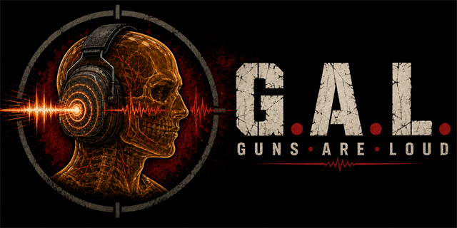

# Guns Are Loud (G.A.L.) — gunfire, hearing loss and active headsets for SPT

[English](README.md) · [Русский](README.ru.md)

**Guns Are Loud** changes how your own gunfire sounds and what it does to your hearing in **SPT (Single Player Tarkov)**. Shots have more low-end weight, and firing a rifle indoors is much harsher on your ears. Keep shooting and the world becomes muffled, with ringing that takes time to fade. A grenade going off nearby can leave you barely hearing anything for several minutes.

The mod builds on EFT's original weapon recordings. Active headsets protect your hearing and change how you hear the world: each model has its own isolation, amplification, sound and response to loud events.

**Version:** 1.1.1

**Supported game:** SPT 4.1.5 on Windows x64

[Download](https://github.com/Anamelash/spt-guns-are-loud/releases/latest) · [All releases](https://github.com/Anamelash/spt-guns-are-loud/releases) · [Discord](https://discord.gg/w2DpURxtrf) · [GitHub Issues](https://github.com/Anamelash/spt-guns-are-loud/issues)

## What you will hear in a raid

- **Your own shots have more weight.** A copy of the original recording pitched an octave lower adds bass and impact. This follows every round of automatic fire at the weapon's actual rate of fire.
- **Cartridges sound different.** Pistol rounds, intermediate cartridges such as 5.45×39, full-power rifle rounds such as 7.62×54R, shotgun shells and heavy 12.7 mm rounds get different amounts of added weight. Suppressors remove most of that added impact.
- **Indoor shots sound harsher.** Room reflections are stronger, and firing inside a building causes more temporary hearing loss than firing outdoors.
- **Hearing loss and ringing build up.** Repeated shots make your surroundings quieter and duller; long bursts take longer to recover from. With a rifle, the ear closer to the muzzle is affected more. Switching shoulders reverses the difference.
- **Gunfire stands out from the background.** Gunshot Contrast lowers ambience, footsteps and character speech by a fixed amount. Those useful cues become quieter too, so adjust it to taste. Music, interface sounds and voice chat are unchanged.

### Grenades

A close explosion can leave you with strong muffling and ringing. Distance, indoor or outdoor surroundings, walls between your head and the blast, and your headset all affect how severe it is.

Without protection, a nearby blast can reduce the world to a quiet, muffled rumble for minutes. Low sounds remain audible while higher frequencies fade away, then gradually return as your hearing recovers.

Headsets reduce the after-effect. In the mod, ordinary ear cups roughly halve it: a grenade across the room can still muffle your hearing and leave it ringing, but the effect is less severe than with bare ears. In-ear protection with a high protection rating reduces it further.

## Active headsets

In **Realistic** mode, you hear sound through both the ear cups and the microphones. The cups provide passive protection that varies with frequency. The electronics amplify quiet surroundings, turn down loud events, and recover afterwards.

The profiles cover 29 headset items across 15 real models and families, including supported variants from WTT-ContentBackport and Epic's All In One.

### How the models differ

In the mod, Sordin, ComTac V and VI, and Ops-Core profiles sound relatively clean and quiet. Consumer models such as Walker's Razor and Earmor M32 amplify more, produce more hiss and react more slowly to loud sounds. The first crack of a shot can get through before they turn the sound down. The analog GSSh-01 and ComTac II profiles also have a slower response.

The electronics change the tone too. They pass a limited range of frequencies, bring out the mids around 3 kHz and reduce some bass. A faint hiss is audible in quiet places and gets lost under louder surroundings and gunfire. Loud peaks are softened, and digital profiles add a few milliseconds of delay.

Published figures are used where available: the Sordin microphone range is 100 Hz–10 kHz, GSSh-01 uses 300–7000 Hz, and Walker's Razor has a 0.02 s response time. Other settings are estimates based on the device's construction and its settings in EFT. These profiles approximate the equipment; they are not complete measurements of every headset.

### Item inspection

In Realistic mode, the headset card shows passive protection at low, mid and high frequencies, gain, compressor attack and recovery, microphone range, hiss and sound colouring. Tooltips include the available manufacturer figures. An asterisk marks an estimate or a value borrowed from a related model.

Vanilla mode shows compressor recovery and gain. Unknown headset models keep vanilla processing. If Realistic processing cannot be used, the mod also falls back to Vanilla.

## Installation and updates

You need **SPT 4.1.5 on Windows x64**, with the Unity 2022.3.43f1 player shipped with that version. BepInEx 5 is included with SPT. Other Unity player builds are not automatically supported: the preloader checks for the supported game and audio component before loading it.

1. Close the game.
2. Extract the release archive into your SPT installation folder.
3. Merge the included `BepInEx` folders with the existing ones. Do not replace the entire BepInEx directory.
4. Start the game through the SPT Launcher.

The archive contains three required files:

- `BepInEx/plugins/GunsAreLoud/GunsAreLoud.Client.dll`
- `BepInEx/patchers/GunsAreLoud/GunsAreLoud.Preloader.dll`
- `BepInEx/patchers/GunsAreLoud/AudioPluginGalHeadphones.dll`

**Replace all three when updating.** They must come from the same release. Mixing versions leaves headset processing on Vanilla; the reason is recorded in the log.

Your saved settings are preserved. Older settings are migrated on first launch where needed. The release archive needs no compilation, Unity Editor, separate installer or manual game-file edits.

## Settings

Press **F12** to open Configuration Manager. The main controls are grouped into:

- **General:** the master switch, loudness preset, Hearing Loss and Ringing switches, Headset Processing, Headset Fit and Hear-through Character.
- **Gunshots:** impact, contrast, indoor emphasis, hearing-loss and ringing intensity and duration, and the difference between your ears.
- **Explosions:** hearing-loss and ringing strength and duration, close-blast duration, outdoor radius and the indoor radius multiplier.

The presets give you a starting point: **Balanced** is restrained, **Loud** makes gunfire more dominant, and **Punishing** gives it the strongest and longest effects.

**Hearing Loss** and **Ringing** can each be turned off for both gunfire and explosions. Their strength and duration are adjusted separately, so you can keep the heavier shots without either after-effect.

**Headset Processing** selects Vanilla or Realistic. **Headset Fit** changes how much protection the hearing model assumes: Loose represents a poor seal, Normal the baseline, and Tight a good seal. It does not change the headset's sound.

### Hear-through Character

`Hear-through Character, %` adjusts the tone, hiss and soft limiting of headset electronics in Realistic mode.

| Value | What you hear |
|---|---|
| 0% | No added colouring or hiss; amplification, microphone range and protection remain |
| 100% | The estimated character of each headset |
| Up to 200% | More pronounced colouring, hiss and limiting |

This setting does not affect Vanilla mode.

The **Advanced** checkbox reveals the controls under **Low-level & debug**. Most players can leave those at their defaults.

## Status and troubleshooting

**F12 → General → Headset Diagnostics** shows the status of Realistic headset processing:

| Status | Meaning |
|---|---|
| `DSP loading` | Waiting for the raid audio to load |
| `DSP ready` | The audio component is available, but active Realistic processing is not currently confirmed; this can happen in Vanilla mode or without a headset |
| `DSP active` | Realistic processing is connected and running |
| `DSP error` | A problem was detected; check `BepInEx/LogOutput.log` |

If something sounds wrong, report it on [GitHub](https://github.com/Anamelash/spt-guns-are-loud/issues) with `BepInEx/LogOutput.log` from that session. Include your SPT version, headset and the settings you were using.

For more detail, **Performance Summary Log** and **Log Every Local Shot** under Low-level & debug write to `BepInEx/plugins/GunsAreLoud/GunsAreLoud.Diagnostics.log`. Both are off by default. Log Every Local Shot turns itself off at the next game start; enable it when reproducing a problem.

## Uninstallation

Close the game and remove:

- `BepInEx/plugins/GunsAreLoud`
- `BepInEx/patchers/GunsAreLoud`

You can also remove `BepInEx/config/com.anamelash.gunsareloud.cfg` to discard the saved settings.

The release archive does not modify `globalgamemanagers` or put files in the game's native `Plugins` directory. If you used a development build that required manual registration there, first restore its original game-metadata backup, then remove the native DLL it installed. Do not leave a preload entry pointing to a DLL you have removed.

## Scope and limitations

G.A.L. changes the local player's sound and hearing. Ballistics, recoil, damage, health, AI hearing, other players' gunshot sources and EFT's original sound files are unchanged. The headset profiles are client-side; no server-side item changes are needed.

The model uses relative digital audio levels. They are not calibrated sound-pressure measurements and cannot tell you how much real hearing protection equipment provides or how safe real gunfire or blasts are.

## Documentation and feedback

- [CHANGELOG.md](CHANGELOG.md) — differences from vanilla and changes between releases.
- [MODEL.md](MODEL.md) — the audio and hearing model, formulas and limitations.
- [Headset reference](docs/reference/headphones/README.md) — sources and calibration choices for the headset profiles.

Questions and discussion are welcome on [Discord](https://discord.gg/w2DpURxtrf). Use [GitHub Issues](https://github.com/Anamelash/spt-guns-are-loud/issues) for bug reports and suggestions. Downloads are under [Releases](https://github.com/Anamelash/spt-guns-are-loud/releases).
